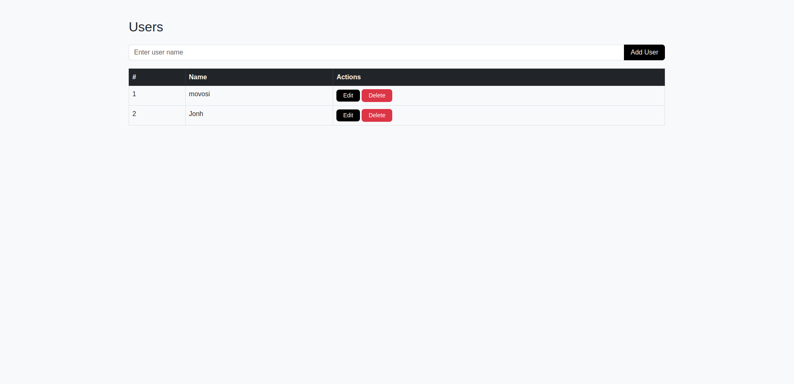

# Socket.io + Node + MySQL

  
  


This is a Node.js application designed to demonstrate the use of various packages like `socket.io` and `mysql2`. It provides a robust foundation for building real-time applications with database connectivity.

## Requirements

Before starting, ensure you have the following installed:

- Node.js (v14 or higher)
- npm (Node Package Manager)

## Installation

1. Clone the repository:
   ```bash
   git clone <repository-url>
   cd socket.io_node_mysql
   ```

2. Install the required dependencies:
   ```bash
   npm install
   ```

   To install specific dependencies manually:
   ```bash
   npm install socket.io
   npm install mysql2
   npm install --save-dev nodemon
   ```

   The app uses the following key dependencies:
   - `socket.io`: For real-time communication.
   - `mysql2`: For MySQL database integration.
   - `nodemon`: For automatically restarting the server during development.

## Starting the Application

To start the application, run:
```bash
npm start
```

This will launch the server, and you can access the app at `http://localhost:3000` (or the configured port).

Alternatively, during development, you can use `nodemon` to automatically restart the server on file changes:
```bash
nodemon app.js
```

Below is an example of the application's output:



### Available Routes

- `/`: The root route, typically used for testing or displaying a welcome message.
- `/users`: A route for user-related operations, such as fetching or managing user data.

## Additional Notes

- Ensure your MySQL database is running and properly configured in the application.
- Modify the `.env` file to set up your database credentials and other environment variables.

